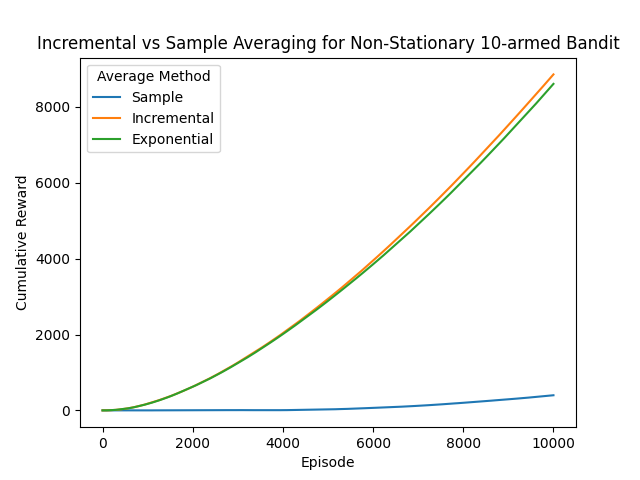

I took Machine Learning this Spring (with an RL section at the end), and Reinforcement Learning this Summer, so I picked up a used copy of [Sutton and Barto Second Edition](http://incompleteideas.net/book/the-book-2nd.html).

Chapter 2 exercise 5 was asking that you compare a sample average with a fixed alpha or exponential moving average for a non-stationary n-bandit problem. In this case, 10 bandits were all initialized to zero, then each take a random step (drawn from a gaussian with an average of zero and a standard deviation of 0.01) after each episode.

Chart and code reproduced below. The problem with the sample average is that it equally weights more recent samples with the earliest ones. However, we know from the construction of the problem, that the expected values of each bandit are constantly changing. This makes the incremental (fixed-alpha) and exponentially weighted averages preferable for this case.

Between the incremental and exponential cases, the exponential one is less susceptible to the bias of the initialization. However, for this test, the bias matched the starting condition, so there was little difference between the two approaches.

Interestingly, my first crack at this showed that the sample average outperformed the other two. However, averaging across 1,000 runs, the incremental and exponential averages perform much better.



```python
import random

import matplotlib.pyplot as plt

EPSILON = 0.1
N_BANDITS = 10
INIT_ESTIMATE = 0
INIT_VALUE = 0
BANDIT_SELECT_STD = 1
ALPHA = 0.1
STEPS = 10000
RANDOM_WALK_AVG = 0
RANDOM_WALK_STD = 0.01
PLOT_NAME = "sample_vs_incremental_nonstationary_n_bandit.png"
N_TRIALS = 1000

random.seed(42)


def experiment(
    rl,
    num_bandits=N_BANDITS,
    steps=STEPS,
    init=INIT_VALUE,
    random_avg=RANDOM_WALK_AVG,
    random_std=RANDOM_WALK_STD,
):
    bandits = [init for _ in range(N_BANDITS)]
    rewards = []

    for i in range(steps):
        for bandit_i in range(num_bandits):
            bandits[bandit_i] += random.gauss(mu=RANDOM_WALK_AVG, sigma=RANDOM_WALK_STD)

        action = rl.select()
        reward = random.gauss(mu=bandits[action], sigma=BANDIT_SELECT_STD)

        rl.update(action, reward)

        if rewards:
            rewards.append(rewards[-1] + reward)
        else:
            rewards.append(reward)

    return rewards


class BaseRL:
    def __init__(
        self, epsilon=EPSILON, n_bandits=N_BANDITS, init_estimate=INIT_ESTIMATE
    ):
        self.epsilon = epsilon
        self.bandit_estimates = [init_estimate for _ in range(n_bandits)]

    def select(self):
        if self.epsilon > random.random():
            return int(random.random() * len(self.bandit_estimates))
        else:
            return self.bandit_estimates.index(max(self.bandit_estimates))


class SampleAverageRL(BaseRL):
    def __init__(self, **kwargs):
        super().__init__(**kwargs)
        self.bandit_counts = [0 for _ in range(len(self.bandit_estimates))]

    def update(self, action, reward):
        self.bandit_counts[action] += 1
        self.bandit_estimates[action] += (
            1 / (self.bandit_counts[action]) * (reward - self.bandit_estimates[action])
        )


class IncrementalRL(BaseRL):
    def __init__(self, alpha=ALPHA, **kwargs):
        super().__init__(**kwargs)
        self.alpha = alpha

    def update(self, action, reward):
        self.bandit_estimates[action] += self.alpha * (
            reward - self.bandit_estimates[action]
        )


class ExponentialDecayRL(BaseRL):
    def __init__(self, alpha=ALPHA, **kwargs):
        super().__init__(**kwargs)
        self.alpha = alpha

    def update(self, action, reward):
        self.bandit_estimates[action] = (
            self.alpha * reward + (1 - self.alpha) * self.bandit_estimates[action]
        )


def main():
    sample_rl = SampleAverageRL()
    incremental_rl = IncrementalRL()
    exponential_rl = ExponentialDecayRL()

    sample_results = experiment(sample_rl)
    incremental_results = experiment(incremental_rl)
    exponential_results = experiment(exponential_rl)

    for i in range(1, N_TRIALS):
        if i % 100 == 0:
            print(f"Trial {i}")

        trial_sample_rl = experiment(sample_rl)
        trial_incremental_rl = experiment(incremental_rl)
        trial_exponential_rl = experiment(exponential_rl)

        for j in range(STEPS):
            sample_results[j] += 1 / i * (trial_sample_rl[j] - sample_results[j])
            incremental_results[j] += (
                1 / i * (trial_incremental_rl[j] - incremental_results[j])
            )
            exponential_results[j] += (
                1 / i * (trial_exponential_rl[j] - exponential_results[j])
            )

    plt.plot(sample_results, label="Sample")
    plt.plot(incremental_results, label="Incremental")
    plt.plot(exponential_results, label="Exponential")
    plt.legend(title="Average Method")
    plt.xlabel("Episode")
    plt.ylabel("Cumulative Reward")
    plt.title(
        f"Incremental vs Sample Averaging for Non-Stationary {N_BANDITS}-armed Bandit"
    )

    plt.savefig(PLOT_NAME)


if __name__ == "__main__":
    main()
```